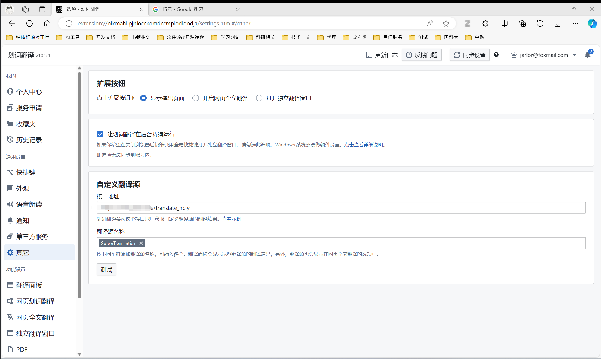
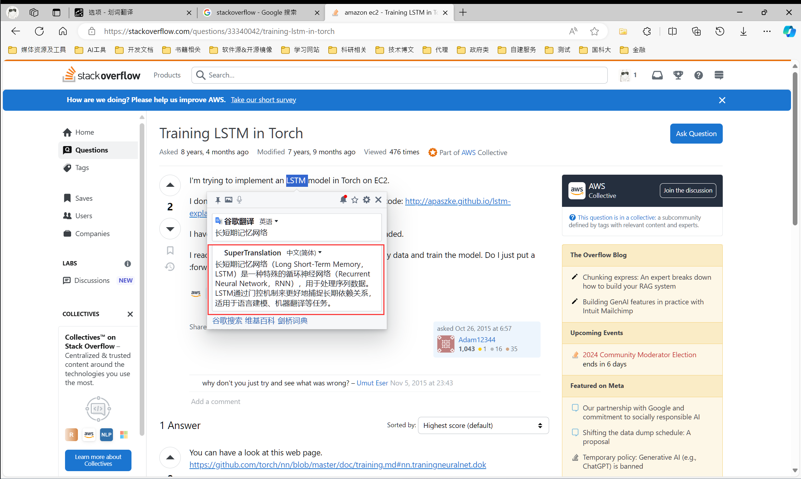
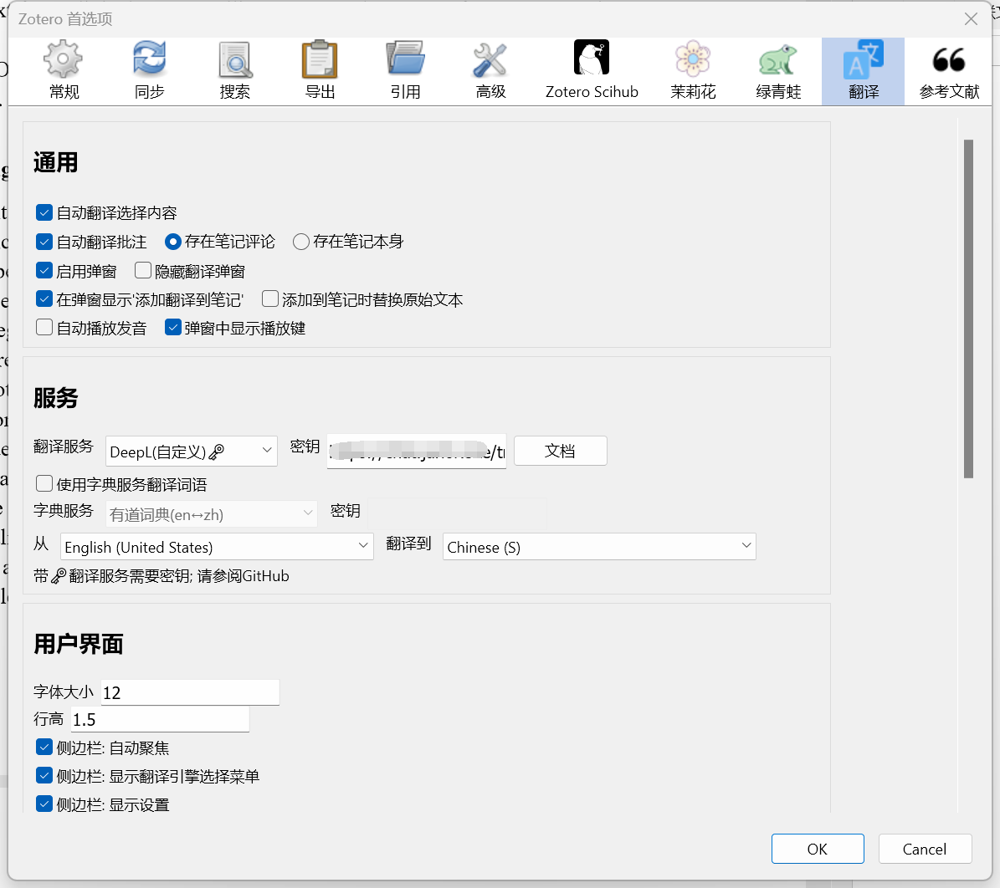
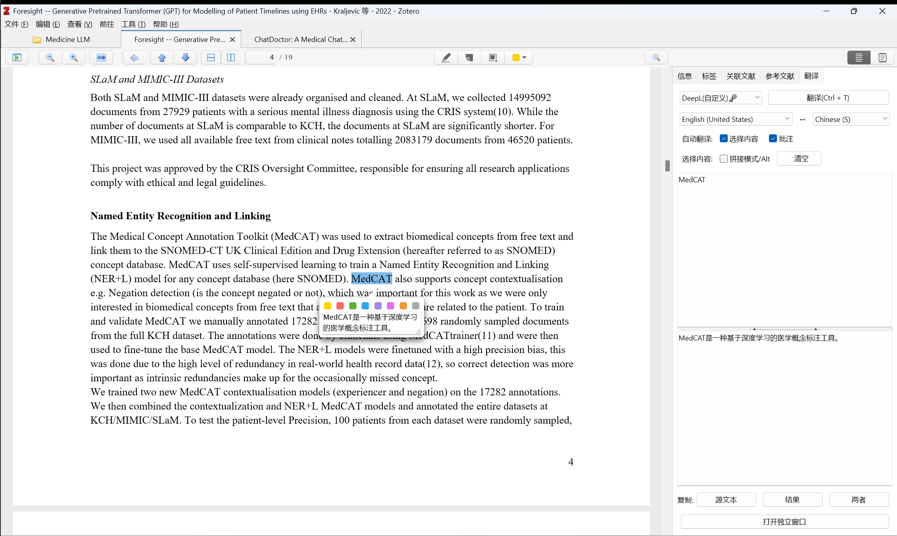

# SuperTranslation

## Introduction

Comprehensive enhancement of real-time translation function based on OpenAI GPT3.5 model.

## Features

### Special Feature

- Formula explanation
- Code explanation
- Terms explanation

### Supported Field

- Deep Learning

### Supported Language

- English to Chinese

### Supported Platform
- Web Browser
- Zotero
## Deployment
you can deploy the server on your own machine or ECS. \
### Required Environment
Now you should have the following software installed on your machine and get some required parameters:
- `Python 3.8+`
  - install the required packages by running `pip install -r requirements.txt`
- `OpenAI API Key`
  - get the API key from [OpenAI](https://platform.openai.com/api-keys)
- `Nginx`(optional)
  - install the Nginx server and configure the reverse proxy to the server if you deploy this server in ECS.
### Configuration
(no writing yet)
## Application
### Browser Extension
#### 1.Basic Plug-in Installation
Install [划词翻译](https://hcfy.app/) Plug-in.
#### 2. Configuration
- open the plug-in settings page
- navigate to the `通用设置-其他` tab.
- set the `自定义翻译源-接口地址` to `<your server address>/translate_hcfy`
- given a name to the `自定义翻译源-翻译名称` field.like `SuperTranslation`,then press `enter` to save.\
\
Now you can use the SuperTranslation plugin to translate the text you selected.\

### Zotero Plugin
#### 1. Basic Plug-in Installation
Install [Translate for Zotero](https://github.com/windingwind/zotero-pdf-translate) Plug-in.
#### 2. Configuration
- open the plug-in settings page in Zotero.
- navigate to the `服务` tab and choose `Deepl(自定义)` in the `翻译服务` field.
- set the `密钥` to `<your server address>/translate_zotero`.
- uncheck the `使用字典服务翻译词语` option.
- click `OK` to save.\
\
Now you can use the SuperTranslation plugin to translate the text you selected.\

## Planned Features
- translate and explain the reasons for code errors.